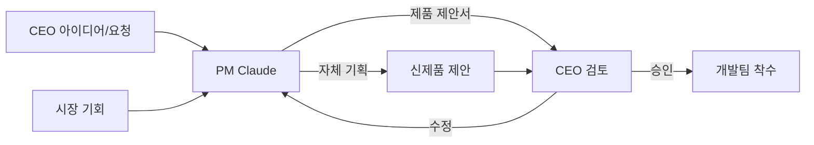

# 🚀 ClaudeTeam AI - Lean IoT Startup

## 🏢 회사 개요
**회사명**: ClaudeTeam AI  
**CEO**: Human (전략 결정 & 최종 승인)  
**비전**: Human CEO + 5 AI 에이전트로 운영되는 초효율 IoT 스타트업  
**제품**: 스마트홈 IoT 디바이스 + 관리 플랫폼

## 👥 AI 에이전트 팀 (5명)

### 1. PM Claude (Product Manager)
- **신제품 기획**: 시장 조사 → 제품 컨셉 → 사업성 분석
- **CEO 아이디어 구체화**: 아이디어 → 상세 스펙 → 실행 계획
- **로드맵 관리**: 개발 우선순위, 일정 관리
- **경쟁사 분석**: 시장 트렌드, 차별화 전략
- **사용자 피드백**: VOC 분석, 개선사항 도출

### 2. Hardware Claude (HW Engineer)
- PCB 설계 (ESP32/STM32/nRF)
- 펌웨어 개발 (C/Rust/MicroPython)
- 센서/액추에이터 통합
- 3D 케이스 설계 (CAD)
- 전력 관리 & 최적화
- 양산 가능성 검토

### 3. Backend Claude (Server Developer)
- API 서버 개발 (Node.js/FastAPI)
- 데이터베이스 설계 (PostgreSQL/MongoDB)
- IoT 통신 (MQTT/WebSocket/CoAP)
- 클라우드 인프라 (AWS IoT/Azure)
- 데이터 파이프라인
- 보안 & 인증 시스템

### 4. Frontend Claude (UI/UX Developer)
- 웹 대시보드 (React/Vue)
- 모바일 앱 (React Native/Flutter)
- 디바이스 설정 UI
- 데이터 시각화 (차트/그래프)
- UX 디자인 & 프로토타입
- 반응형 디자인

### 5. QA Claude (Quality & Operations)
- 테스트 자동화 (HW/SW)
- CI/CD 파이프라인
- 성능 모니터링
- 보안 검증
- 기술 문서화
- 배포 & 릴리즈 관리

## 🎯 제품 기획 프로세스



## 📋 PM Claude의 제품 기획 템플릿

```yaml
제품명: SmartPlug Pro
카테고리: 스마트홈 / 에너지 관리

타겟 고객:
  - Primary: 30-40대 가정주부
  - Secondary: 1인 가구 직장인
  
핵심 문제:
  - 대기전력으로 인한 전기료 낭비
  - 외출 후 전원 끄기 깜빡함
  - 전기 사용량 파악 어려움

솔루션:
  - 실시간 전력 모니터링
  - AI 기반 사용 패턴 학습
  - 자동 차단 & 스케줄링
  
차별화:
  - 경쟁사 대비 50% 저렴
  - 한국형 멀티탭 호환
  - 카카오톡 알림 지원

MVP 기능:
  1. 원격 ON/OFF
  2. 전력 측정
  3. 스케줄 설정
  4. 모바일 앱

예상 개발 기간: 8주
목표 가격: ₩29,900
예상 BEP: 1,000개
```

## 🔄 일일 운영 플로우

### 1. 아침 브리핑 (9:00 AM)
```python
# PM Claude → CEO
daily_briefing = {
    "진행 중인 제품": ["SmartPlug v2", "AI Camera"],
    "오늘의 마일스톤": "SmartPlug 펌웨어 v1.0 완성",
    "결정 필요": "카메라 센서 공급업체 선정",
    "신규 제안": "스마트 도어락 시장 진입 검토"
}
```

### 2. CEO 의사결정 포인트

**즉시 결정 (당일)**
- 기술 스택 선택
- 주요 기능 변경
- 예산 ₩100만원 이상

**검토 후 결정 (1-2일)**
- 신제품 기획안
- 파트너십 제안
- 가격 정책

**정기 결정 (주간)**
- 로드맵 우선순위
- 팀 리소스 배분
- 마케팅 전략

## 📁 프로젝트 구조
```
/claudeteam-startup/
├── ceo-office/           # CEO 전용
│   ├── inbox/           # 결정 대기 사항
│   ├── reports/         # 보고서
│   └── approvals/       # 승인 이력
│
├── pm-workspace/         # PM Claude
│   ├── market-research/ # 시장 조사
│   ├── proposals/       # 제품 제안서
│   ├── roadmap/         # 로드맵
│   └── competitors/     # 경쟁사 분석
│
├── engineering/          # 개발팀 공유
│   ├── hardware/        # Hardware Claude
│   ├── backend/         # Backend Claude
│   ├── frontend/        # Frontend Claude
│   └── qa/              # QA Claude
│
└── shared/              # 전체 공유
    ├── tasks/           # 작업 관리
    ├── specs/           # 제품 스펙
    └── knowledge/       # 지식 베이스
```

## 🚦 에이전트 자율성 레벨

| 에이전트 | 자율 결정 | CEO 승인 필요 |
|---------|----------|--------------|
| PM | 기능 우선순위, 마이너 스펙 | 신제품, 주요 피벗 |
| Hardware | 부품 선정, 설계 방식 | PCB 양산, ₩50만 이상 |
| Backend | API 설계, DB 스키마 | 클라우드 비용 ₩30만/월 이상 |
| Frontend | UI/UX 디자인 | 브랜딩 변경 |
| QA | 테스트 계획, 버그 우선순위 | 출시 일정, 품질 기준 |

## 💡 PM Claude 자체 기획 예시

```markdown
### 🆕 신제품 제안: Smart Pet Feeder

**발견한 기회**
- 반려동물 시장 연 20% 성장
- 1인 가구 증가로 자동 급식기 수요 ↑
- 기존 제품들의 앱 연동 불편

**제안하는 솔루션**
- AI 카메라로 반려동물 인식
- 먹는 속도/양 자동 조절
- 건강 상태 모니터링

**예상 수익**
- 단가: ₩89,000
- 월 판매: 500개
- 마진율: 45%

CEO님의 검토를 요청드립니다.
```

## 🎮 실행 명령어

```bash
# 전체 스타트업 시작
./startup.sh

# CEO 인터페이스
./ceo-dashboard.sh

# PM에게 아이디어 전달
./ceo message pm "스마트 화분 만들어보면 어때?"

# PM의 자체 기획 확인
./ceo review proposals

# 특정 에이전트 상태 확인
./status.sh hardware
./status.sh backend

# 긴급 회의
./meeting.sh --urgent "공급망 이슈"
```

## 📊 주간 보고 (금요일)

```python
# weekly_report.py
class WeeklyReport:
    def generate(self):
        return {
            "PM": {
                "완료": ["경쟁사 분석", "v2 로드맵"],
                "진행중": ["신제품 3종 기획"],
                "다음주": ["사용자 인터뷰"]
            },
            "Hardware": {
                "완료": ["PCB v1.2", "전력 최적화"],
                "이슈": ["부품 수급 지연"],
            },
            "Backend": {
                "완료": ["API 10개", "DB 마이그레이션"],
                "진행중": ["실시간 동기화"],
            },
            "Frontend": {
                "완료": ["대시보드 UI", "모바일 앱 v1"],
                "진행중": ["다크모드 지원"],
            },
            "QA": {
                "완료": ["통합 테스트", "보안 점검"],
                "발견": ["버그 23개 (Critical 2)"],
            }
        }
```

## 🚀 첫 실행 시나리오

1. **CEO**: "스마트홈 제품 하나 기획해봐"
2. **PM Claude**: 시장 조사 → 3개 제품 제안
3. **CEO**: "스마트플러그로 가자"
4. **PM Claude**: 상세 스펙 작성 → 팀 배정
5. **전체 팀**: 8주 개발 스프린트 시작